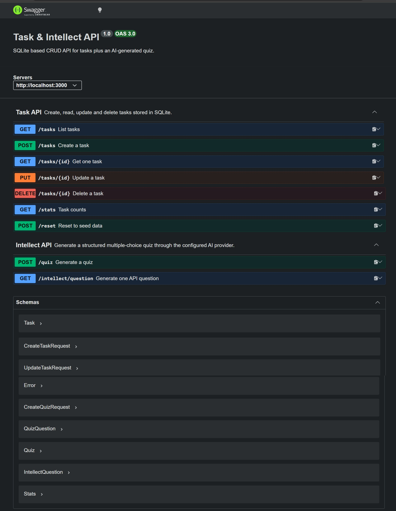

# Task & Intellect API

An Express API with two parts:

```
Task API
  ├── GET /tasks
  ├── GET /tasks/:id
  ├── POST /tasks
  ├── PUT /tasks/:id
  └── DELETE /tasks/:id

Intellect API
  └── POST /quiz
```

[]

Tasks are stored in SQLite. Quizzes are generated by an AI provider behind a small abstraction, so `/quiz` does not call Gemini directly.

**Selected provider:** [Google Gemini](https://ai.google.dev/) (`gemini-3.5-flash`).

OpenAPI docs (Swagger UI) are at [http://localhost:3000/docs](http://localhost:3000/docs).

## Getting started

1. Clone the repository and install dependencies:

```bash
npm install
```

2. Example env file and add your own key. **Do not commit `.env` or put a real API key in this README.**

```bash
AI_PROVIDER=your_ai_provider
AI_MODEL=your_ai_model
MODEL_API_KEY=your_model_api_key
```

3. Start the server:

```bash
npm start
```

or

```bash
npm run dev
```

The API runs at `http://localhost:3000`. Open Swagger at [http://localhost:3000/docs](http://localhost:3000/docs), expand **Intellect API → POST /quiz**, and try it from there.

## Configure the AI provider

Set these in `.env`. The quiz route only talks to `quizService` → `ai.generate()`. Switching providers is a config change, not a rewrite of `/quiz`.

| Variable | Required for | Purpose |
|----------|--------------|---------|
| `AI_PROVIDER` | all | `gemini`, `groq`, or `ollama` |
| `AI_MODEL` | all | Model id, for example `gemini-3.5-flash` |
| `MODEL_API_KEY` | Gemini | API key from [Google AI Studio](https://aistudio.google.com/) |

## Call `POST /quiz`

**Request body**

| Field | Rules |
|-------|--------|
| `topic` | Required non-empty string |
| `difficulty` | One of `easy`, `medium`, `hard` |
| `amount` | Integer from `1` to `10` |

Invalid bodies return `400` and never call the AI provider.

**Example request**

```bash
curl -X POST http://localhost:3000/quiz \
  -H "Content-Type: application/json" \
  -d '{"topic": "JavaScript", "difficulty": "easy", "amount": 5}'
```

**Example response**

```json
{
  "topic": "API",
  "difficulty": "easy",
  "questions": [
    {
      "question": "What does the 'R' stand for in a RESTful API architecture?",
      "options": ["Remote", "Representational", "Request", "Routing"],
      "correctAnswer": "Representational"
    }
  ],
  "provider": "gemini",
  "model": "gemini-3.5-flash"
}
```

The server only returns a quiz after the AI JSON passes schema validation (four options per question, `correctAnswer` in `options`, and exactly `amount` questions). After each request, the terminal logs provider, model, tokens, estimated cost, duration, attempt and success/failure.

## Why SQLite?

SQLite was chosen because it is a real SQL database that still fits a small local project:

- No separate database server to install or run — just a library (`better-sqlite3`) and a file
- Data survives server restarts 
- Synchronous API, which keeps the Express handlers simple (no `async`/`await` for queries)
- Enough SQL to practice `SELECT`, `INSERT`, `UPDATE`, and `DELETE` without the overhead of Postgres or MySQL

## Database file

Tasks are stored in **`tasks.db`** in the project root (the same folder as `index.js`).

The file is created automatically the first time the app starts. It is listed in `.gitignore`, so each machine keeps its own copy.

### Example SQL query

On startup, the app runs queries like this to read every row:

```sql
SELECT id, title, done, created_at, updated_at FROM tasks ORDER BY id;
```

That is the same data you get from `GET /tasks`. Each task also stores `created_at` and `updated_at` (set on insert; `updated_at` is refreshed on every successful `PUT`).

## Endpoints

### `GET /`

Returns metadata about the API.

**Response**

```json
{
  "name": "Task & Intellect API",
  "version": "1.0",
  "docs": "/docs",
  "endpoints": {
    "tasks": ["GET /tasks", "GET /tasks/:id", "POST /tasks", "PUT /tasks/:id", "DELETE /tasks/:id"],
    "intellect": ["POST /quiz"]
  }
}
```

**Example**

```bash
curl http://localhost:3000/
```

### `GET /health`

Health check endpoint.

**Response**

```json
{
  "status": "OK"
}
```

**Example**

```bash
curl http://localhost:3000/health

### `GET /tasks`

Returns all tasks. Optional query parameters filter the list (the part after `?` - filters, not addresses).

| Query | Example | Effect |
|-------|---------|--------|
| `done` | `?done=true` | Only finished tasks |
| `done` | `?done=false` | Only open tasks |
| `search` | `?search=milk` | Title contains the word (case-insensitive) |

Filters can be combined: `?done=false&search=book`

**Response**

```json
[
  {
    "id": 1,
    "title": "Buy a book",
    "done": true,
    "created_at": "2026-08-27 13:38:30",
    "updated_at": "2026-08-27 13:38:30"
  },
  {
    "id": 2,
    "title": "Go on a morning walk",
    "done": true,
    "created_at": "2026-08-27 13:38:30",
    "updated_at": "2026-08-27 13:38:30"
  },
  {
    "id": 3,
    "title": "Go to market",
    "done": false,
    "created_at": "2026-08-27 13:40:00",
    "updated_at": "2026-08-27 13:40:00"
  }
]
```

**Example**

```bash
curl http://localhost:3000/tasks
curl "http://localhost:3000/tasks?done=true"
curl "http://localhost:3000/tasks?search=milk"
```

### `GET /stats`

Returns counts computed in SQL with `COUNT()` (not by looping in JavaScript).

**Response**

```json
{ "total": 7, "done": 3, "open": 4 }
```

**Example**

```bash
curl http://localhost:3000/stats
```

### `POST /reset`

Restores the three seed example tasks. Useful for demos and testing.
Clears the database and restores the three seed example tasks.

**Response (200)**

```json
[
  {
    "id": 1,
    "title": "Buy a book",
    "done": true,
    "created_at": "2026-08-27 13:38:30",
    "updated_at": "2026-08-27 13:38:30"
  },
  {
    "id": 2,
    "title": "Go on a morning walk",
    "done": true,
    "created_at": "2026-08-27 13:38:30",
    "updated_at": "2026-08-27 13:38:30"
  },
  {
    "id": 3,
    "title": "Go to market",
    "done": false,
    "created_at": "2026-08-27 13:40:00",
    "updated_at": "2026-08-27 13:40:00"
  }
]
```

**Example**

```bash
curl -X POST http://localhost:3000/reset
```

### `GET /tasks/:id`

Returns a single task by id.

**Response (200)**

```json
{ "id": 1, "title": "Buy a book", "done": true, "created_at": "2026-08-27 13:38:30", "updated_at": "2026-08-27 13:38:30" }
```

**Response (404)**

```json
{ "error": "Task 50 is not found" }
```

**Example**

```bash
curl http://localhost:3000/tasks/1
curl http://localhost:3000/tasks/50

### `POST /tasks`

Creates a new task.

**Request body**

```json
{ "title": "Buy milk" }
```

**Response (201)**

```json
{ "id": 4, "title": "Buy milk", "done": false, "created_at": "2026-08-27 13:45:00", "updated_at": "2026-08-27 13:45:00" }
```

**Response (400)**

```json
{ "error": "title is required and cannot be empty" }
```

**Example**

```bash
curl -i -X POST http://localhost:3000/tasks -H "Content-Type: application/json" -d "{\"title\":\"Buy milk\"}"

### `PUT /tasks/:id`

Updates a task's `title` and/or `done`. Send one or both fields; omitted fields stay unchanged.

**Request body**

```json
{ "title": "Buy oat milk", "done": true }
```

**Response (200)**

```json
{ "id": 1, "title": "Buy oat milk", "done": true, "created_at": "2026-08-27 13:46:30", "updated_at": "2026-08-27 13:46:30" }
```

**Response (400)**

```json
{ "error": "request body must include title and/or done" }
```

**Response (404)**

```json
{ "error": "Task 50 not found" }
```

**Example**

```bash
curl -i -X PUT http://localhost:3000/tasks/1 -H "Content-Type: application/json" -d "{\"done\": false}"
```

### `DELETE /tasks/:id`

Deletes a task.

**Response (204)**

Empty body - success, nothing to return.

**Response (404)**

```json
{ "error": "Task 50 not found" }
```

**Example**

```bash
curl -X DELETE http://localhost:3000/tasks/1
